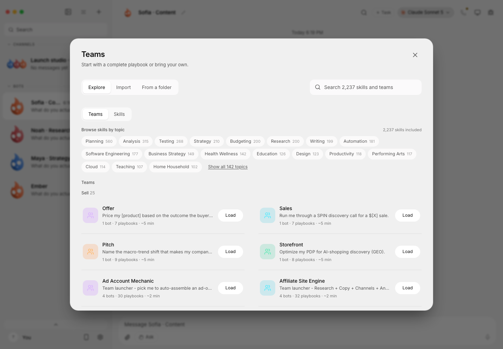

**Run a team of AI agents from one desktop app.**

[Download](#download) · [What it does](#what-it-does) · [Current limits](#current-limits)

Murage brings your agents, conversations, tasks and approvals into one workspace. Give each agent—an **Ember**—a role and an engine, work with it directly, or bring several agents into a shared channel.

## Download

**Fuigo is built into the desktop installers for Mac, Windows and Linux.** Install Murage, then connect your provider account or API key. You do not need a JavaScript toolchain or an `npm install` command.

**[Latest release and release notes](https://github.com/FerroxLabs/murage-releases/releases/latest)**

**Murage 0.1.51** restores parallel conversations across different agents using Auto or This computer. An agent working on a reply no longer reserves the desktop for its entire turn. Actual desktop tool calls remain exclusive, and each agent's default browser profile stays separate.

The release retains clearer onboarding, a persistent Inbox, saved Files and reports, managed memory, independent conversation controls and native Fuigo updates. **Fuigo 1.0.10 is included.** See the [latest release notes](https://github.com/FerroxLabs/murage-releases/releases/latest) for the complete changes and platform verification.

These direct links always download the latest public release:

| Platform | Download |
|---|---|
| macOS Apple Silicon | [Murage.dmg](https://github.com/FerroxLabs/murage-releases/releases/latest/download/Murage.dmg) |
| macOS Intel | [Murage-intel.dmg](https://github.com/FerroxLabs/murage-releases/releases/latest/download/Murage-intel.dmg) |
| Windows x64 | [Murage-setup.exe](https://github.com/FerroxLabs/murage-releases/releases/latest/download/Murage-setup.exe) |
| Ubuntu 24.04 x64 | [Murage-amd64.deb](https://github.com/FerroxLabs/murage-releases/releases/latest/download/Murage-amd64.deb) |
| Ubuntu 24.04 x64, portable | [Murage.AppImage](https://github.com/FerroxLabs/murage-releases/releases/latest/download/Murage.AppImage) |

macOS packages are signed and notarized. The Windows installer, application and bundled Fuigo executable are signed. [Ubuntu checksums](https://github.com/FerroxLabs/murage-releases/releases/latest/download/SHA256SUMS-ubuntu-x64.txt) are available alongside the downloads.

### Install and start

1. **macOS:** open the DMG and move Murage to Applications. **Windows:** run the installer. **Ubuntu:** install the DEB with `sudo apt install ./Murage-amd64.deb`, or run `chmod +x Murage.AppImage` and open the AppImage.
2. Open Murage and configure an engine in Settings. **Fuigo is included**; other CLI engines need their own installation and login.
3. Choose an engine and model for your Ember, then start a conversation. Review permission requests before approving actions.

**Installed desktop builds require no Node.js, npm, pnpm or separate Fuigo installation.** Model access is separate: use the login or API credentials required by your chosen provider. Provider charges and subscription eligibility still apply.

## What it does

- **Catch up on work:** use the persistent Inbox and saved Files to find results, review decisions and return to the source conversation.
- **Keep useful context:** managed memory and independent task settings keep knowledge and controls scoped to the work.
- **Manage the engine:** update native Fuigo independently, roll back to the previous verified version or return to the bundled engine. Provider login remains separate.

- **Agents with distinct roles:** give each Ember its own instructions, model and task history. Adapters include Fuigo, Claude Code, Codex, custom ACP agents and compatible API endpoints.
- **Shared channels and delegation:** bring agents into a conversation, assign work and follow their replies and activity.
- **Routines and reviewed actions:** schedule recurring work and handle approval cards in chat. The host running the agents must remain available for scheduled work.
- **Connected tools:** use configured Composio connections or your own MCP servers. Availability and sign-in requirements depend on your setup; custom MCP tools are not automatically pre-approved.
- **Browser and computer tools:** supported configurations can give an agent a browser, local computer or separate machine, with explicit controls and platform-specific prerequisites.

Fuigo retains its intended global and project configuration. Murage does not replace your provider account or make every engine support the same tools. Use desktop settings for credentials; do not include secrets in shared configuration or bug reports.

## A look inside

Browse included teams and skills in the current app:

Review a Product Launch team before adding it. These screenshots use fictional demo data; no private conversations or live business results are shown.

## Current limits

- Reported engine errors `-32603` and unexpected exit `1073807364` remain under investigation. The reproduced Claude background-task notification bug was fixed, but that does not establish a fix for every reported engine error.
- An intermittent Mac shutdown delay during credential-write drain remains a known limitation. Later signed native checks exited cleanly; the original delay and native credential persistence were not conclusively resolved. See the [release notes](https://github.com/FerroxLabs/murage-releases/releases/latest).

- **Windows:** see [release notes](https://github.com/FerroxLabs/murage-releases/releases/latest) for Windows verification and known limitations.
- **Ubuntu:** the desktop app supports GNOME Xorg and Wayland, but local computer control is currently restricted to Xorg. Linux dictation and ARM64 packages are unavailable.
- **External channels:** messaging channels are not yet a verified end-to-end Murage feature; Slack, WhatsApp and similar services cannot be assumed supported because an underlying engine supports them. Fuigo's scoped Murage tool discovery, real calls, approval/cancellation and inherited configuration have been verified separately.
- Broader cloud onboarding and complete installation-recovery acceptance remain ongoing work. The retired native iOS companion was never released.

## About this repository

This public repository distributes official Murage installers, release notes and updater metadata. The Murage application source repository is currently private; this downloads repository does not provide a source checkout or developer build instructions. Its public availability does not change source access.

Browse [all releases](https://github.com/FerroxLabs/murage-releases/releases) for previous versions and their notes.

## Credits and license

Murage is developed by **Ferrox Labs** and is a fork of [OpenMausBot](https://github.com/milind-soni/OpenMausBot), created by Milind Soni and its contributors. Murage is independently maintained and is not affiliated with or endorsed by the upstream project.

Licensed under Apache 2.0. See [LICENSE](LICENSE) and [NOTICE](NOTICE). Bundled third-party components retain their own licenses and attribution in the application distribution.
